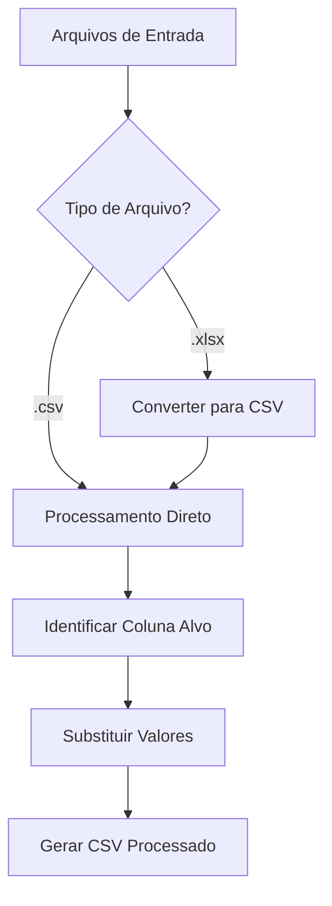

# 📊 Ferramenta de Processamento de Dados CSV/Excel

Utilitário em Go para processamento em lote de arquivos CSV/Excel com substituição de valores em colunas específicas.


## ✨ Funcionalidades Principais
- **Conversão Excel para CSV**: Transforma automaticamente arquivos `.xlsx` em CSV
- **Substituição de Valores**: Altera valores em colunas específicas com regras configuráveis
- **Processamento em Massa**: Processa todos os arquivos do diretório de entrada
- **Resiliência a Erros**: Ignora arquivos não suportados e trata erros graciosamente
- **Saída Organizada**: Estrutura resultados em pastas dedicadas

## ⚙️ Pré-requisitos
- Go 1.16+
- Biblioteca Excelize: `go get github.com/xuri/excelize/v2`

## 🔧 Configuração (.env)
```ini
DATA_OUTPUT_DIR=data      # Diretório de saída
DOCS_DIR=docs             # Pasta com arquivos originais
COLUMN_NAME=status        # Coluna alvo para modificação
VALUES=ativo,inativo     # Valores originais (separados por vírgula)
OVERWRITE=ATIVO,INATIVO  # Novos valores (separados por vírgula)
DEFAULT=DESCONHECIDO     # Valor padrão para entradas não mapeadas
```

## 🚀 Instalação & Uso
1. Clone o repositório:
```bash
git clone https://github.com/seuusuario/processador-dados.git
cd processador-dados
```

2. Instale dependências:
```bash
go mod tidy
```

3. Configure o arquivo `.env`:
```bash
cp .env.exemplo .env
nano .env
```

4. Execute o processador:
```bash
go run main.go
```

## 📌 Exemplo Prático
**Arquivo Original (dados.xlsx)**:
```csv
id,nome,status
1,João,ativo
2,Maria,inativo
3,Pedro,pendente
```

**Arquivo Processado (sanitized_dados.csv)**:
```csv
id,nome,status
1,João,ATIVO
2,Maria,INATIVO
3,Pedro,DESCONHECIDO
```

## 🔄 Fluxo de Processamento


## 🛑 Tratamento de Erros
| Caso de Erro | Ação |
|--------------|------|
| Coluna obrigatória faltando | Processo interrompido com mensagem de erro |
| Arquivo vazio | Arquivo ignorado, erro registrado |
| Formato Excel inválido | Erro de conversão registrado, arquivo ignorado |
| Problemas de permissão | Erros de criação de diretório registrados |

## 🔧 Personalização
1. **Novos Mapeamentos**:
```ini
# .env
VALUES=alto,médio,baixo
OVERWRITE=CRÍTICO,ALERTA,INFO
```

2. **Adicionar Suporte a Novos Formatos**:
```go
// Adicionar suporte para ODS
case ".ods":
    return converterODSParaCSV(...)
```

3. **Processar Múltiplas Colunas**:
Modifique o código para aceitar múltiplas colunas no `.env`

4. **Lógica Personalizada para Valores Padrão**:
```go
// Alterar lógica do valor padrão
mapeado = strings.ToUpper(Default)
```

## 📄 Licença
MIT License - Veja [LICENSE](LICENSE) para detalhes.

---

**Otimizações**:
- Criação automática de diretórios
- Preserva estrutura original dos arquivos
- Mantém ordem dos cabeçalhos CSV
- Pronto para processamento paralelo (futura melhoria)

**Nota**: Para logs detalhados, ajuste o nível do zerolog para DEBUG durante o desenvolvimento.