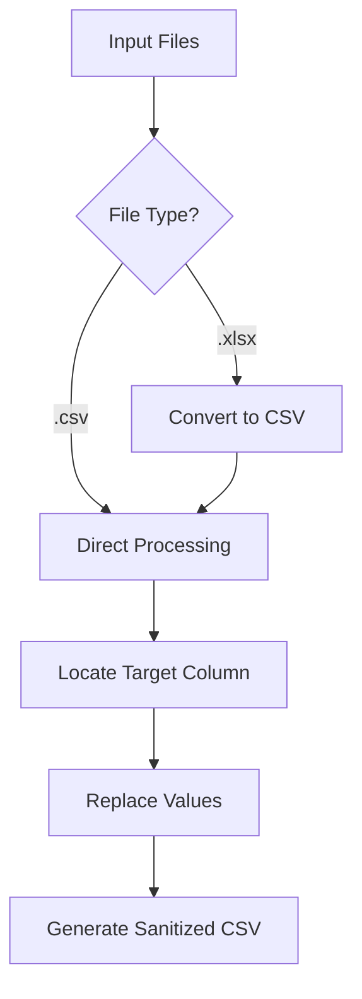

# 📊 CSV/Excel Data Processing Tool

Go utility for batch processing CSV/Excel files with value replacement in specific columns.


## ✨ Key Features
- **Excel to CSV Conversion**: Automatically converts `.xlsx` files to CSV
- **Value Mapping**: Replaces values in specified columns using configurable rules
- **Batch Processing**: Processes all files in input directory
- **Error Resilient**: Skips unsupported files and handles conversion errors gracefully
- **Structured Output**: Organizes results in dedicated folders

## ⚙️ Prerequisites
- Go 1.16+
- Excelize library: `go get github.com/xuri/excelize/v2`

## 🔧 Configuration (.env)
```ini
DATA_OUTPUT_DIR=data      # Output directory for processed files
DOCS_DIR=docs             # Input directory containing source files
COLUMN_NAME=status        # Target column for value replacement
VALUES=active,inactive   # Original values to match (comma-separated)
OVERWRITE=ACTIVE,INACTIVE # New values for replacement (comma-separated)
DEFAULT=UNKNOWN          # Default value for unmatched entries
```

## 🚀 Installation & Usage
1. Clone repository:
```bash
git clone https://github.com/yourusername/data-processor.git
cd data-processor
```

2. Install dependencies:
```bash
go mod tidy
```

3. Configure `.env` file:
```bash
cp .env.example .env
nano .env
```

4. Run processor:
```bash
go run main.go
```

## 📌 Example Workflow
**Input File (data.xlsx)**:
```csv
id,name,status
1,John,active
2,Mary,inactive
3,Peter,pending
```

**Output File (sanitized_data.csv)**:
```csv
id,name,status
1,John,ACTIVE
2,Mary,INACTIVE
3,Peter,UNKNOWN
```

## 🔄 Processing Flow


## 🛑 Error Handling
| Error Case | Resolution |
|------------|------------|
| Missing required column | Process terminates with error message |
| Empty input file | File skipped, error logged |
| Invalid Excel format | Conversion error logged, file skipped |
| Permission issues | Directory creation errors logged |

## 🔧 Customization Options
1. **Add New Mappings**:
```ini
# .env
VALUES=high,medium,low
OVERWRITE=CRITICAL,WARNING,INFO
```

2. **Extend File Support**:
```go
// Add new case for ODS files
case ".ods":
    return convertODSToCSV(...)
```

3. **Multiple Column Processing**:
Modify code to accept multiple COLUMN_NAME entries

4. **Custom Fallback Logic**:
```go
// Change default value logic
mapped = strings.ToUpper(Default)
```

## 📄 License
MIT License - See [LICENSE](LICENSE) for details.

---

**Optimizations**:
- Automatic output directory creation
- Preserves original file structure
- Maintains CSV header order
- Parallel processing ready (future enhancement)

**Note**: For detailed logging, set zerolog level to DEBUG in code for development purposes.